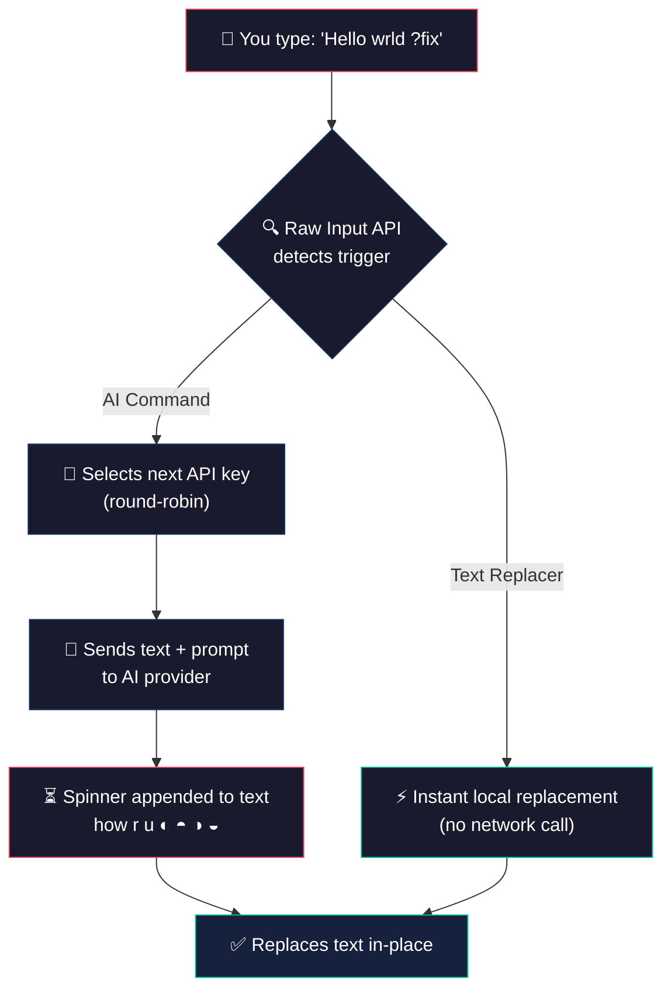

<div align="center">

<br>

# SwiftSlate Desktop

### System-wide AI text transformation for Windows

Type a trigger like **`?fix`** at the end of any text, in any app, and watch it get replaced — instantly.

<br>

[](#-getting-started)
[](#%EF%B8%8F-tech-stack)
[](LICENSE)

<br>

[](#-getting-started)
&nbsp;&nbsp;
[](https://github.com/Musheer360/SwiftSlate-Desktop/issues)
&nbsp;&nbsp;
[](https://github.com/Musheer360/SwiftSlate-Desktop/issues)

<br>

> Linux support coming soon.

</div>

<br>

## 📋 Table of Contents

- [Quick Demo](#-quick-demo)
- [Features](#-features)
- [Getting Started](#-getting-started)
- [Built-in Commands](#-built-in-commands)
- [Supported AI Providers](#-supported-ai-providers)
- [API Key Management](#-api-key-management)
- [Configuration](#%EF%B8%8F-configuration)
- [Custom Commands](#%EF%B8%8F-custom-commands)
- [How It Works](#-how-it-works)
- [Debug Mode](#-debug-mode)
- [Privacy & Security](#-privacy--security)
- [Tech Stack](#%EF%B8%8F-tech-stack)
- [Building from Source](#-building-from-source)
- [Known Limitations](#%EF%B8%8F-known-limitations)
- [Contributing](#-contributing)
- [Support the Project](#-support-the-project)
- [License](#-license)

<br>

## ⚡ Quick Demo

```
You type:     "i dont no whats hapening ?fix"
You see:      "i dont no whats hapening ◐"  (spinner animates)
Result:       "I don't know what's happening."
```

```
You type:     "hey can u send me that file ?formal"
You see:      "hey can u send me that file ◐"  (spinner animates)
Result:       "Could you please share the file at your earliest convenience?"
```

```
You type:     "Hello, how are you? ?translate:es"
You see:      "Hello, how are you? ◐"  (spinner animates)
Result:       "Hola, ¿cómo estás?"
```

<br>

## ✨ Features

<table>
<tr>
<td width="50%">

### 🌐 Works Everywhere
Integrates at the system level via Windows Raw Input API. Works in **every app** — browsers, editors, messaging apps, terminals, IDEs, and more.

### ⚡ Instant Inline Replacement
Type, trigger, done. The AI response replaces your text directly in the same field — no copy-pasting, no app switching. While processing, an animated spinner appends to your text (e.g., `how r u ◐`) so you always see progress.

### 🔑 Multi-Key Rotation
Add multiple API keys for automatic round-robin rotation. If one key hits a rate limit, SwiftSlate seamlessly switches to the next.

</td>
<td width="50%">

### 🤖 Multi-Provider AI
Ships with Google Gemini, Groq, or connect **any OpenAI-compatible endpoint** — cloud providers, or **local LLMs** like [Ollama](https://ollama.com), [LM Studio](https://lmstudio.ai), and others running locally.

### 🛠️ Two Command Types
**AI commands** send text to your provider for intelligent transformation. **Text replacer commands** run entirely offline for instant local text manipulation — no API key needed.

### 🔄 Hot Reload
Edit your config or commands file and changes apply within 2 seconds — no restart needed.

</td>
</tr>
</table>

<br>

## 🚀 Getting Started

### One-Line Install

```powershell
irm https://cdn.jsdelivr.net/gh/Musheer360/SwiftSlate-Desktop@master/install.ps1 | iex
```

The installer handles everything — downloads a portable Python runtime if needed, sets up the config, and optionally adds to startup.

Run the same command again to **update** or **uninstall**.

### Prerequisites

| Requirement | Details |
|:------------|:--------|
| **Windows** | Windows 10 or 11 (64-bit) |
| **API Key** | Free Gemini key at [aistudio.google.com](https://aistudio.google.com/api-keys), or Groq at [console.groq.com/keys](https://console.groq.com/keys), or any OpenAI-compatible provider. *Not required for text replacer commands.* |

> [!NOTE]
> Python is **not** required on your system. If not found, the installer downloads an embedded Python runtime (~15 MB) that lives entirely inside the `.swiftslate` folder.

<br>

## 🧩 Built-in Commands

SwiftSlate ships with **10 AI-powered commands**, dynamic translation, and **clipboard commands** — ready to use out of the box:

| Trigger | Action | Example |
|:--------|:-------|:--------|
| **`?fix`** | Fix grammar, spelling & punctuation | `i dont no whats hapening` → `I don't know what's happening.` |
| **`?improve`** | Improve clarity and readability | `The thing is not working good` → `The feature isn't functioning properly.` |
| **`?shorten`** | Shorten while keeping meaning | `I wanted to let you know that I will not be able to attend` → `I can't attend.` |
| **`?expand`** | Expand with more detail | `Meeting postponed` → `The meeting has been postponed. We'll share the updated schedule soon.` |
| **`?formal`** | Rewrite in professional tone | `hey can u send me that file` → `Could you please share the file at your earliest convenience?` |
| **`?casual`** | Rewrite in friendly tone | `Please confirm your attendance` → `Hey, you coming? Let me know!` |
| **`?emoji`** | Add relevant emojis | `I love this new feature` → `I love this new feature! 🎉❤️✨` |
| **`?human`** | Humanize AI-generated text | `I hope this email finds you well` → `Hope you're doing well` |
| **`?reply`** | Generate a contextual reply | `Do you want to grab lunch?` → `Sure! What time works for you?` |
| **`?undo`** | Restore text before last replacement | Reverts to your original text |
| **`?translate:XX`** | Translate to any language | `Hello` **`?translate:es`** → `Hola` |

### Text Replacers (instant, offline)

| Trigger | Action |
|:--------|:-------|
| **`?date`** | Today's date |
| **`?time`** | Current time |
| **`?ip`** | Public IP address |

### Clipboard Commands

| Trigger | Action |
|:--------|:-------|
| **`?copy`** | Copy preceding text to internal clipboard |
| **`?cut`** | Cut preceding text |
| **`?paste`** | Paste after existing text |
| **`?replace`** | Replace all text with clipboard content |

<br>

## 🤖 Supported AI Providers

| Provider | Recommended Models | Notes |
|:---------|:-------|:------|
| **Google Gemini** (default) | `gemini-3.5-flash-lite` (default), `gemini-3.6-flash` | Free tier at [aistudio.google.com](https://aistudio.google.com/api-keys). Thinking level set to `minimal` for fast inline transforms. |
| **Groq** | `openai/gpt-oss-120b` (default), `qwen/qwen3.6-27b` | Free tier at [console.groq.com](https://console.groq.com/keys). Per-model reasoning params applied automatically. |
| **Custom (OpenAI-compatible)** | Any model your endpoint supports | Works with Ollama, LM Studio, vLLM, any `/v1/chat/completions` endpoint |

> [!TIP]
> For local LLMs, set the endpoint to your machine's local address (e.g., `http://localhost:11434/v1` for Ollama).

<br>

## 🔑 API Key Management

SwiftSlate supports multiple API keys with intelligent rotation:

| Feature | Details |
|:--------|:--------|
| **Round-Robin Rotation** | Keys are used in turn to spread usage evenly |
| **Rate-Limit Handling** | If a key gets rate-limited (HTTP 429), SwiftSlate tracks the cooldown and skips it automatically |
| **Invalid Key Detection** | Keys returning 401/403 errors are marked invalid and excluded from rotation |
| **Automatic Retry** | Transient network errors retry once after 1 second; server errors rotate to the next key |

> [!TIP]
> Adding **2–3 API keys** helps avoid rate limits during heavy use.

<br>

## ⚙️ Configuration

All settings live in `%USERPROFILE%\.swiftslate\` and hot-reload automatically:

**config.json**
```json
{
  "api_keys": ["your-key-1", "your-key-2"],
  "model": "gemini-3.5-flash-lite",
  "provider": "gemini",
  "temperature": 0.5,
  "prefix": "?",
  "key_delay": 200,
  "spinner": "animated"
}
```

| Field | Description |
|:------|:------------|
| `api_keys` | Array of API keys (supports multiple for rotation) |
| `model` | Model name for your provider |
| `provider` | `groq`, `gemini`, or `custom` |
| `temperature` | Response creativity (0.0 = deterministic, 1.0 = creative) |
| `prefix` | Trigger prefix character (default: `?`) |
| `endpoint` | Required for `custom` provider (e.g., `http://localhost:11434/v1`) |
| `key_delay` | Milliseconds between dependent keystrokes (default: `200`). Decrease to `100` on fast machines for snappier response, increase to `300` on very slow machines if text replacement glitches. The spinner animation speed automatically scales with this value. |
| `spinner` | Progress indicator mode: `animated` (default — spinning ◐◓◑◒), `static` (shows `[Processing...]` with zero animation keystrokes — the most reliable option for slow machines), or `off` (no visual feedback). |

<br>

## 🛠️ Custom Commands

Add your own commands in `commands.json`:

```json
[
  { "trigger": "email", "type": "replacer-text", "value": "you@example.com" },
  { "trigger": "sig", "type": "replacer-text", "value": "Best regards,\nYour Name" },
  { "trigger": "uuid", "type": "replacer-shell", "value": "powershell -NoProfile -Command \"[guid]::NewGuid()\"" },
  { "trigger": "eli5", "type": "ai", "prompt": "Explain this like I'm five years old." },
  { "trigger": "bullet", "type": "ai", "prompt": "Convert this text into bullet points." }
]
```

### Command Types

| Type | How It Works | Needs API Key? | Latency |
|:-----|:-------------|:---------------|:--------|
| **`ai`** | Sends text to your AI provider with your custom prompt | Yes | ~1–3 seconds |
| **`replacer-text`** | Replaces the trigger with a fixed string, entirely offline | No | Instant |
| **`replacer-shell`** | Runs a shell command and replaces with its output | No | Instant |

> [!CAUTION]
> **Shell commands run unsandboxed.** The `replacer-shell` type executes arbitrary commands with your user privileges. Never import `commands.json` files from untrusted sources — a malicious command could compromise your system the moment you type its trigger.

<br>

## 🔧 How It Works



<details>
<summary>🔧 <strong>Technical deep-dive</strong></summary>

<br>

1. **Keystroke Capture** — Registers a hidden window with Windows Raw Input API to receive all keyboard events system-wide (same API class used by accessibility tools)
2. **Fast Exit Optimization** — Checks if the last character matches any known trigger's last character before doing a full scan
3. **Longest Match** — When a potential match is found, searches for the longest matching trigger at the end of the buffer
4. **Buffer Safety** — Buffer clears automatically on window change, navigation keys, Enter, Escape, and Tab to prevent cross-app trigger collisions
5. **Command Routing** — Text replacer commands execute immediately on-device. AI commands proceed to the API call path with retry logic
6. **Key Rotation & Retry** — Rotates through available keys, skipping rate-limited or invalid ones. Retries on network errors and server failures
7. **Inline Spinner** — While waiting for the AI response, the trigger is replaced with an animated spinner appended to your original text (e.g., `how r u ◐`) to show progress
8. **Text Replacement** — Uses Ctrl+A / Ctrl+V via SendInput to replace field content
9. **Clipboard Safety** — All clipboard operations use exclusion flags to prevent pollution of Windows clipboard history
10. **Singleton Guard** — File lock prevents duplicate instances from running simultaneously

</details>

<br>

## 🐛 Debug Mode

```powershell
cd $env:USERPROFILE\.swiftslate
python SwiftSlate.pyw --debug
```

If using the embedded runtime:

```powershell
cd $env:USERPROFILE\.swiftslate
.\runtime\python.exe SwiftSlate.pyw --debug
```

This runs in the foreground with full logging — shows every keystroke match, API call, and error.

<br>

## 🔒 Privacy & Security

| | Concern | How SwiftSlate Desktop Handles It |
|:--|:--------|:------------------------|
| 👁️ | **Text Monitoring** | Only processes text when a trigger command is detected at the end of the keystroke buffer. All other typing is completely ignored. |
| 📡 | **Data Transmission** | Text is sent **only** to the configured AI provider (Google Gemini, Groq, or your custom endpoint). No other servers are ever contacted. Text replacer commands never leave your machine. |
| 📊 | **Analytics** | **None.** Zero telemetry, zero tracking, zero crash reporting. |
| 📖 | **Open Source** | The entire codebase is open for inspection under the MIT License. |
| 🔑 | **Permissions** | Runs as a standard user process — no admin/elevated privileges required. |
| 📋 | **Clipboard Safety** | All clipboard operations use Windows exclusion flags to prevent pollution of clipboard history and cloud sync. |

<br>

## 🏗️ Tech Stack

<table>
<tr><td><strong>Language</strong></td><td>Python (runs on 3.10+)</td></tr>
<tr><td><strong>Input Capture</strong></td><td>Windows Raw Input API</td></tr>
<tr><td><strong>Key Simulation</strong></td><td>SendInput (KEYBDINPUT)</td></tr>
<tr><td><strong>Message Loop</strong></td><td>GetMessageW (blocking, zero CPU when idle)</td></tr>
<tr><td><strong>HTTP</strong></td><td><code>urllib</code> (zero external dependencies)</td></tr>
<tr><td><strong>JSON</strong></td><td><code>json</code> (stdlib)</td></tr>
<tr><td><strong>Concurrency</strong></td><td><code>threading</code> (API calls run off main thread)</td></tr>
<tr><td><strong>Config Watch</strong></td><td>Polling mtime every 2 seconds (hot reload)</td></tr>
</table>

> **Zero third-party dependencies** — uses only Python standard library and Windows APIs via ctypes.

<br>

## 🔨 Building from Source

### Prerequisites

- **Windows 10/11** (64-bit)
- **Python 3.10+** (or use the embedded runtime from the installer)

### Run

```powershell
# Clone the repository
git clone https://github.com/Musheer360/SwiftSlate-Desktop.git
cd SwiftSlate-Desktop

# Run in debug mode
python SwiftSlate.pyw --debug
```

### Verify Syntax

```powershell
python -c "import py_compile; py_compile.compile('SwiftSlate.pyw', doraise=True)"
```

> [!NOTE]
> The entire app is a single `SwiftSlate.pyw` file with zero pip dependencies. No build step required.

<br>

## ⚠️ Known Limitations

- **Text replacement uses Ctrl+A → Ctrl+V** — this selects all and pastes, which works in most standard text fields. In apps with non-standard input handling (e.g., some terminal emulators, certain game overlays), replacement may not work as expected.
- **Single-line buffer** — SwiftSlate tracks keystrokes in a buffer that clears on window switch, Enter, Escape, and Tab. Triggers must be typed in a single uninterrupted sequence within the same field.
- **Windows only** — currently requires Windows 10/11. Linux support is planned.

<br>

## 🤝 Contributing

Contributions are welcome! See [CONTRIBUTING.md](CONTRIBUTING.md) for full details.

```bash
# 1. Fork the repository, then:
git clone https://github.com/YOUR_USERNAME/SwiftSlate-Desktop.git
cd SwiftSlate-Desktop

# 2. Create a feature branch
git checkout -b feature/amazing-feature

# 3. Make your changes and test
python SwiftSlate.pyw --debug

# 4. Verify syntax
python -c "import py_compile; py_compile.compile('SwiftSlate.pyw', doraise=True)"

# 5. Push and open a Pull Request
git push origin feature/amazing-feature
```

### Ideas for Contributions

- 🐧 Linux support (porting keystroke detection and text replacement)
- 🧩 New built-in commands
- 🤖 Additional AI provider integrations
- 🐛 Bug fixes for text replacement edge cases
- 📖 Documentation improvements

<br>

## ❤️ Support the Project

SwiftSlate Desktop is free, open source, and built in my spare time. If it's useful to you, consider supporting its development:

- ⭐ **Star this repo** — it helps others discover SwiftSlate
- 💖 [**Sponsor on GitHub**](https://github.com/sponsors/Musheer360) — even a small contribution keeps the project going

<br>

## 📄 License

This project is licensed under the **MIT License** — see the [LICENSE](LICENSE) file for details.

<br>

---

<div align="center">

<br>

Part of the [**SwiftSlate**](https://github.com/Musheer360/SwiftSlate) family.

Made with ❤️ by [**Musheer Alam**](https://github.com/Musheer360)

If SwiftSlate makes your typing life easier, consider giving it a ⭐

<br>

</div>
